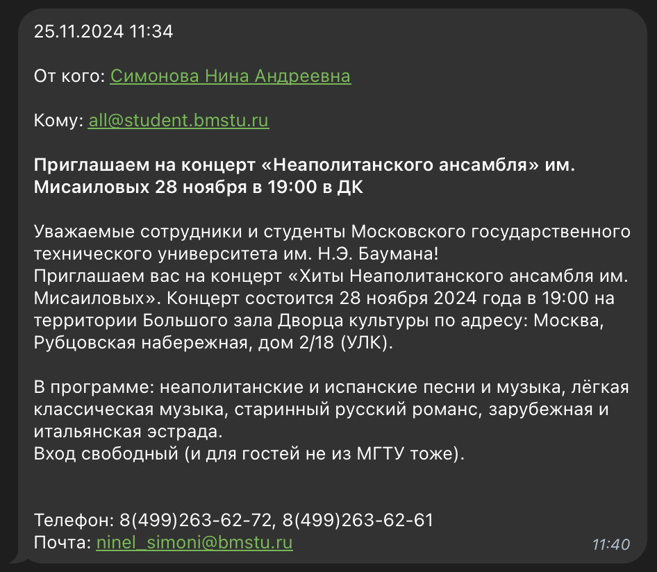

# Samowarium

Клиент [Самовара](https://student.bmstu.ru/) внутри телеги.



## Как установить

На машине должны быть установлены git ([инструкция по установке](https://git-scm.com/downloads)), docker ([инструкция по установке](https://docs.docker.com/desktop/)).

1. Склонировать репозиторий и перейти в директорию

```bash
git clone https://github.com/bmstudents/samowarium
cd samowarium
```

2. Переименовать файл `.env.example` -> `.env` и выставить обязательные переменные

Из обязательных переменных есть только одна `TELEGRAM_TOKEN` -- токен для телеграм бота ([инструкция, как получить](https://core.telegram.org/bots/tutorial#obtain-your-bot-token)). Полученное значение надо подставить после знака `=` для переменной `TELEGRAM_TOKEN`. Остальные переменные являются необязательными или уже имеют стандартные значения, их можно не менять.

3. Запустить бота

```bash
sudo docker compose up -d
```

4. Проверить, что все работает
   
После запуска статус контейнера с ботом должен быть `healthy`. Это можно посмотреть при помощи команды, найдя строку с нужным контейнером (по умолчанию называется `samowarium-samowarium-1`)

```bash
sudo docker ps
```

4.1 Если что-то сломалось или не получилось

Можно написать [ишую](https://github.com/bmstudents/samowarium/issues) или в [чат поддержки](https://t.me/+oPdw7R04oREzMDgy).

## Для разработки

- Переименовать `.env.example` -> `.env` и выставить токен для бота.

- Использовать python3.12 и выше.

- Установить зависимости:

```bash
pip install -r requirements.txt
```

- Запустить бота:

```bash
python3 ./src/samowarium.py
```

- Создать миграцию:

```bash
yoyo new --sql -m "migration name"
```

## Для работы с Docker

- Собрать образ:

```bash
docker compose build
```

- Или получить из регистра:

```bash
docker compose pull
```

- Запустить сервис (не забыть создать `.env` файл с переменными):

```bash
docker compose up -d
```

- Остановить сервис:

```bash
docker compose down
```
